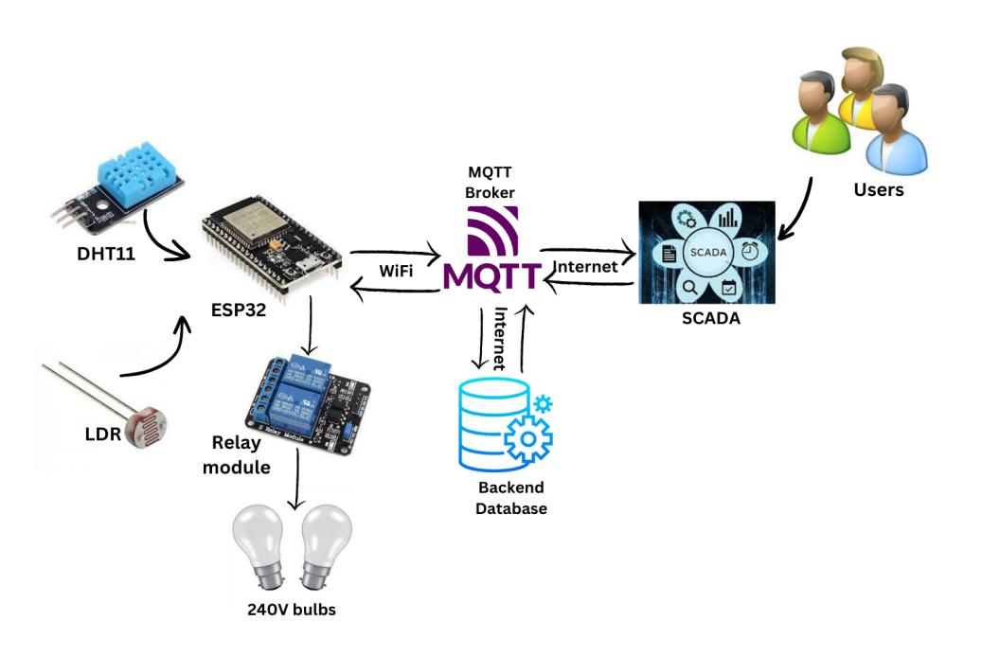

___
# HOME AUTOMATION SYSTEM
___

## Introduction

Home automation is becoming more and more common in today's society since it provides
comfort, convenience, and energy efficiency. As technology has advanced, the Internet of
Things (IoT) has made it possible to create "smart homes," where multiple appliances and
equipment can be connected to and controlled remotely through the internet.

The goal of this project is to create an Internet of Things (IoT)-based home automation
system that uses sensors and a mobile user interface to track and control a house's
temperature, humidity, and light intensity. Through a smartphone application, the system will
allow users to monitor temperature and humidity levels, automatically turn on and off light
bulbs, and set those parameters to their preferences.

## Overview

We will use the appropriate sensors in this IOT-based home automation project using the
ESP32 to detect the temperature, humidity, and light intensity. An ESP32 microcontroller will
be attached to these sensors, and it will gather data from them.

We will then design a mobile UI to show the sensor information. The mobile interface will use
Wi-Fi to connect to the ESP32 microcontroller and receive data from it, which it will then use
to show readings in real time. The system will be controlled and monitored by mobile apps.

We'll automate the light bulbs' on/off switching via the mobile app in addition to displaying
the sensor information. Relays that can control the light bulbs will be used to do this.

We will use the MQTT protocol, a lightweight messaging standard that is widely used in IOT
devices, to store the sensor values. The MQTT broker will store the data in a database after
receiving the sensor readings from the ESP32 microcontroller.

## High Level Solution Architecture

## Circuit Diagram

### Team members:
1. E/18/170 Karunarathna W.K. [e180170@eng.pdn.ac.lk]
2. E/18/203 Madhusanka K.G.A.S. [e18203@eng.pdn.ac.lk]
3. E/18/224 Mihiranga G.D.R. [e18224@eng.pdn.ac.lk]

### Project supervisors: 
1. Dr. Kamalanath Samarakoon [kamalanath@eng.pdn.ac.lk]

### Links:
1. [Github Repository](https://github.com/cepdnaclk/e18-co326-home-automation-system-group01)
2. [Department of Computer Engineering](http://www.ce.pdn.ac.lk/)
3. [Department of Computer Engineering Github Pages](https://github.com/cepdnaclk)