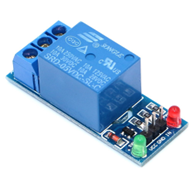

[comment]: # "This is the standard layout for the project, but you can clean this and use your own template"

# Home Automation System

## Team
- E/18/170, Karunarathna W.K., [email](e180170@eng.pdn.ac.lk)
- E/18/203, Madhusanka K.G.A.S., [email](e18203@eng.pdn.ac.lk)
- E/18/224, Mihiranga G.D.R., [email](e18224@eng.pdn.ac.lk)

## Table of Contents
1. [Introduction](#introduction)
2. [Overview](#overview)
3. [Hardware Components](#hardware-components)
4. [High Level Solution Architecture](#high-level-solution-architecture)
5. [Circuit Diagram](#circuit-diagram)
5. [Calculations](#calculations)
5. [Budget](#budget)
6. [Links](#links)

---

## Introduction
Home automation is becoming more and more common in today's society since it provides comfort, convenience, and energy efficiency. As technology has advanced, the Internet of Things (IoT) has made it possible to create "smart homes," where multiple appliances and equipment can be connected to and controlled remotely through the internet.

The goal of this project is to create an Internet of Things (IoT)-based home automation system that uses sensors and a mobile user interface to track and control a house's temperature, humidity, and light intensity. Through a smartphone application, the system will allow users to monitor temperature and humidity levels automatically turn on and off light bulbs, and set those parameters to their preferences.

---

## Overview
We will use the appropriate sensors in this IOT-based home automation project using the ESP32 to detect the temperature, humidity, and light intensity. An ESP32 microcontroller will be attached to these sensors, and it will gather data from them.

We will then design a mobile UI to show the sensor information. The mobile interface will use Wi-Fi to connect to the ESP32 microcontroller and receive data from it, which it will then use to show readings in real time. The system will be controlled and monitored by mobile apps.

We'll automate the light bulbs' on/off switching via the mobile app in addition to displaying the sensor information. Relays that can control the light bulbs will be used to do this.

We will use the MQTT protocol, a lightweight messaging standard that is widely used in IOT devices, to store the sensor values. The MQTT broker will store the data in a database after receiving the sensor readings from the ESP32 microcontroller.

---

## Hardware Components
### DHT22 Temperature-Humidity Sensor

The DHT22 sensor is a small size, low consumption & long transmission distance(20m) enable digital temperature and humidity sensor that operates on 3.3V to 6V power and I/O. With a maximum current usage of 2.5mA during data conversion, it is energy-efficient. It provides accurate readings for humidity ranging from 0 to 100% with an accuracy of 2-5%, making it ideal for precise humidity monitoring. The temperature readings are reliable, with an accuracy of ±0.5°C, covering a wide range from -40 to 80°C With a sampling rate of no more than 0.5 Hz (once every 2 seconds), the DHT22 sensor is suitable for applications where slower data acquisition is acceptable. It has a compact body size of 15.1mm x 25mm x 7.7mm, and features 4 pins with 0.1" spacing, making it easy to integrate into various electronic projects. The DHT22 sensor is commonly used in home automation, weather monitoring, HVAC systems, and agriculture applications due to its affordability, reliability, and accuracy in temperature and humidity measurements.

### LDR Sensor

The LDR sensor (Light Dependent Resistor sensor) is a type of passive electronic component that changes its resistance based on the intensity of light falling on it.The LDR sensor typically consists of a semiconductor material that exhibits a higher resistance in the dark and a lower resistance in the presence of light. This characteristic allows LDR sensors to provide analog or digital output that can be used to determine light levels. LDR sensors are typically powered by a DC voltage source and exhibit a slow response time due to the time it takes for the resistance to change in response to changing light levels.

### Relay Module

Single channel relay module is an electronic module that allows a microcontroller or other control signal to control a higher voltage and/or higher current load. Relay uses an electric current to open or close the contacts of a switch. This is usually done using the help of a coil that attracts the contacts of a switch and pulls them together when activated, and a spring pushes them apart when the coil is not energised. Relay module operates with a supply voltage ranging from 3V to 5V, making it compatible with a wide range of power sources. The quiescent current, or the current drawn by the relay module when it is idle, is low at around 2mA, which helps in conserving power. When the relay is active and the load is connected, the relay module draws a current of approximately 70mA to energise the relay and activate the connected load. The relay on the module has a maximum contact voltage rating of 250V AC or 30V DC, which makes it suitable for both AC and DC loads. The relay is capable of handling a maximum current of 10A, allowing it to control high-current devices.

---

## High Level Solution Architecture

---

## Circuit Diagram

---

## Calculations
To Power up the microcontroller, an AC to Dc converter will be used. It will provide 5V to the ESP32 microcontroller. Relays will be used to control A/C bulbs and they are directly connected to A/C power supply. LDR and DHT22 need 3.3v to be operational. Since esp32 output voltage is 3.3v both of them function as required.

Current requirement for components

Maximum output current from ESP32 is 40mA therefore all the components are working properly

---

## Budget

---

## Links

- [Project Repository](https://github.com/cepdnaclk/e18-co326-home-automation-system-group01)
- [Project Page](https://cepdnaclk.github.io/e18-co326-home-automation-system-group01/)
- [Department of Computer Engineering](http://www.ce.pdn.ac.lk/)
- [University of Peradeniya](https://eng.pdn.ac.lk/)

